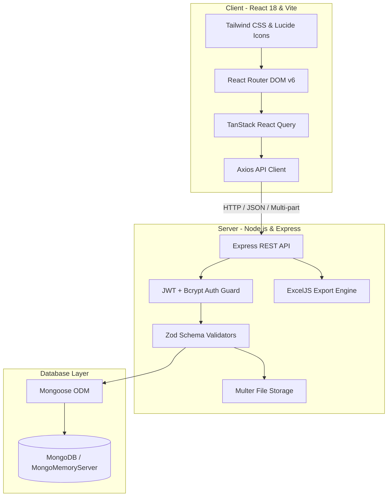
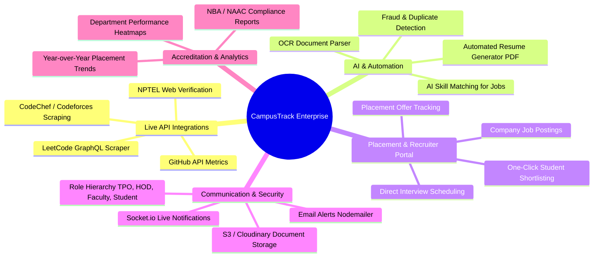

# 🎓 CampusTrack — Full Project Workflow, Implementation & Full-Scale Roadmap

---

## 📌 1. Executive Summary & Project Purpose

**CampusTrack** is a centralized, role-based **Placement, Academic & Student Achievement Verification and Analytics Platform**.

### 🎯 Problem Statement
In higher education institutions:
- Students maintain unstructured proofs (certificates, internships, contest ranks) scattered across cloud drives and emails.
- Faculty mentors and Training & Placement Officers (TPO) face significant overhead manually auditing student submissions.
- Filtering eligible students for placement drives based on real, verified achievements (e.g., minimum CGPA + verified certifications + 200+ solved LeetCode problems) is slow and error-prone.

### 💡 The Solution
CampusTrack solves this by providing:
1. **A Structured Student Portfolio:** A single portal where students register academic metrics and 7 dedicated achievement modules with verifiable proof attachments.
2. **Faculty / Admin Audit & Verification Workflow:** Department coordinators review, approve, or reject submissions with actionable feedback.
3. **Automated TPO Placement Pipeline:** Instant multi-parameter filtering, audit logging, and single-click Excel/CSV report exports for corporate recruiters.

---

## 🏗️ 2. Technology Stack



* **Frontend:** React 18, TypeScript, Vite, Tailwind CSS, Lucide React, TanStack React Query, React Router DOM v6.
* **Backend:** Node.js, Express, TypeScript, Mongoose ODM, Zod, Multer, ExcelJS, Helmet, Express Rate Limit.
* **Database & Fallback:** MongoDB with seamless automatic fallback to `mongodb-memory-server` for zero-configuration local demos and testing.

---

## 🔄 3. End-to-End Workflow

### Step 1: Authentication & Role Routing
- When a user visits `/login`, they authenticate using their institutional credentials.
- The JWT payload encodes their role (`student` or `admin`).
- The application automatically routes them to either `/student/dashboard` or `/admin/dashboard`.

### Step 2: Student Submission Flow
1. The student navigates to any portfolio submodule (e.g., **Projects**, **Internships**, **Certifications**, **NPTEL**, **Hackathons**, **Achievements**, or **Coding Profiles**).
2. The student fills out the structured form (dates, organization, roles, credentials, GitHub/demo URLs) and attaches supporting proof documents (PDF / JPG / PNG).
3. Upon submission, the record is placed in `SUBMITTED` or `UNDER_REVIEW` state.
4. The system updates the student's **Profile Completion Percentage**.

### Step 3: Admin Review & Verification Flow
1. Department coordinators / TPO open `/admin/directory` or `/admin/dashboard`.
2. The admin inspects pending submissions or selects any student to open the comprehensive **`AdminStudentView`**.
3. The coordinator inspects the uploaded certificates directly in the viewer.
4. **Decision:**
   - **Approve:** Record status changes to `VERIFIED`. Coordinator ID and timestamp are recorded.
   - **Reject:** Coordinator inputs a mandatory rejection reason (e.g., *"Certificate name does not match roll number"*). Status changes to `REJECTED`.
5. Every verification action creates an entry in the **`AuditLog`** collection for accountability.

### Step 4: Placement Drive Export Flow
1. TPO applies multi-attribute filters in the directory (Branch = CSE, CGPA >= 7.5, Verified Certifications >= 2, Hackathon Finalists).
2. TPO clicks **Export to Excel / CSV**.
3. The server generates a clean, formatted spreadsheet with verified links and student contact details for direct dispatch to recruiters.

---

## 📂 4. What Has Been Completed So Far (Current Implementation)

### 🔹 Server Modules (`/server/src/`)

| File / Module | Responsibility |
| :--- | :--- |
| **`server.ts` & `app.ts`** | Server entry point, MongoDB connection with auto-fallback, security headers, rate limiting, and route mounting. |
| **`config/db.ts`** | Dual-mode database connector (connects to remote MongoDB or creates an in-memory test instance). |
| **`models/User.ts`** | User schema with bcrypt password hashing and role definitions. |
| **`models/Student.ts`** | Core student details: Roll No, Name, Branch, Section, Batch, CGPA, Semester, Career Interest, Social links, Profile Completion %. |
| **`models/CodingProfile.ts`** | Handles for LeetCode, CodeChef, HackerRank, GeeksforGeeks, ratings, and problem counts. |
| **`models/Project.ts`** | Academic & personal projects, tech stack, GitHub/Demo links, verification state. |
| **`models/Internship.ts`** | Company, role, duration, stipend, offer letter, and completion proof. |
| **`models/Certification.ts`** | Professional certifications (AWS, GCP, Meta, etc.), credential URLs, and proof files. |
| **`models/NPTELRecord.ts`** | NPTEL course codes, scores, elite categories (Gold, Silver, Elite), and certificates. |
| **`models/Hackathon.ts`** | Hackathon participation, team role, project repository, and prize standing. |
| **`models/Achievement.ts`** | Co-curricular & sports achievements categorized by level (College, State, National). |
| **`models/Document.ts`** | Multer file upload tracker (file path, mime type, size, owner). |
| **`models/AuditLog.ts`** | Audit trail recording all admin actions. |
| **`routes/exportRoutes.ts`** | ExcelJS-based dynamic report exporter for TPO drives. |
| **`scripts/seed.ts`** | Automated database seeder creating **1 Admin** and **72 CSE Student accounts** with complete mock portfolios. |

### 🔹 Client Modules (`/client/src/`)

| File / Component | Purpose |
| :--- | :--- |
| **`layouts/StudentLayout.tsx` & `AdminLayout.tsx`** | Responsive sidebar layouts with role-specific navigation, profile headers, and logout. |
| **`pages/Login.tsx`** | Login screen with quick demo role switcher buttons. |
| **`pages/StudentDashboard.tsx`** | Overview of profile completion %, verified item counts, coding stats summary, quick navigation cards. |
| **`pages/StudentProfile.tsx`** | Edit academic metrics, CGPA, contact info, GitHub/LinkedIn/Resume links. |
| **`pages/CodingProfiles.tsx`** | Track competitive coding platform handles & problem counts. |
| **`pages/Projects.tsx`** | Manage academic/personal projects with proof uploads. |
| **`pages/Internships.tsx`** | Track corporate internships and upload offer letters. |
| **`pages/Certifications.tsx`** | Upload and monitor course certifications. |
| **`pages/NPTELRecords.tsx`** | Record NPTEL exam scores and certificates. |
| **`pages/Hackathons.tsx`** | Log hackathons and project links. |
| **`pages/Achievements.tsx`** | Log extracurricular achievements. |
| **`pages/AdminDashboard.tsx`** | High-level college analytics, pending review queues, and metrics. |
| **`pages/AdminDirectory.tsx`** | Searchable, paginated student database with multi-field filtering and export actions. |
| **`pages/AdminStudentView.tsx`** | Full student review screen with certificate previews, inline approval, and rejection reason modals. |
| **`pages/AuditLogs.tsx`** | Live audit history of approvals and rejections. |

---

## 🚀 5. Full-Scale System Architecture & Roadmap (What Will Be In Full Scale)

Below is the vision and feature breakdown for transitioning CampusTrack from its current functional version to an enterprise-grade campus platform:



---

### 🌟 Feature Comparison: Current vs. Full-Scale

| Dimension | Current Implementation | Full-Scale Enterprise Roadmap |
| :--- | :--- | :--- |
| **Coding Statistics** | Manual handle & problem entry | **Live API Sync:** Automated background jobs fetching daily LeetCode solve counts, contest ratings, GitHub commit heatmaps. |
| **Document Verification** | Manual faculty review of uploaded PDFs | **AI-Assisted OCR:** Extracts student name, issuing organization, and dates from certificate images to flag tampering and mismatches automatically. |
| **Resume Generation** | Manual Google Drive links | **Single-Click Verified Resume Generator:** Generates standardized, ATS-friendly single-page PDF resumes containing only verified achievements. |
| **File Storage** | Local disk storage (`uploads/`) | **Cloud Storage:** Amazon S3 / Cloudinary integration with signed URLs and encryption. |
| **Placement Drives** | Export to Excel sheet | **Interactive Placement Portal:** Companies create job drives; system automatically matches eligible candidates and allows students to apply in one click. |
| **Notifications** | In-app status badges | **Multi-channel Alerts:** In-app real-time alerts (WebSockets) + automated email alerts (Nodemailer) on verification status changes. |
| **Accreditation Reports** | Basic student directory export | **Automated NBA / NAAC Reports:** Generates standard accreditation criterion reports (Criterion 5: Student Support & Progression). |
| **Role Hierarchy** | Student & Admin | **Multi-Tier RBAC:** Super Admin (Principal), Department Admin (HOD), Faculty Mentors, TPO Officers, Recruiters, and Students. |

---

## 💻 6. How to Run & Test the Application

### 1. Start Backend Server
```bash
cd server
npm install
npm run dev
```
* **Endpoint:** `http://localhost:5000`
* *In-memory MongoDB runs automatically if local MongoDB is not detected.*
* *Auto-seeding initializes 72 students and 1 admin.*

### 2. Start Frontend Client
```bash
cd client
npm install
npm run dev
```
* **Endpoint:** `http://localhost:5173`

---

## 🔑 7. Demo Credentials

| Role | Username / Email | Password | Access Details |
| :--- | :--- | :--- | :--- |
| **Administrator / TPO** | `admin@college.edu` | `admin123` | Full access to review queues, directory, verification actions, and exports. |
| **Student** | `cse001@college.edu` | `demo123` | Full access to student portfolio submodules, profile editing, and proof uploads. |
| **Alternative Students** | `cse002@college.edu` to `cse072@college.edu` | `demo123` | Diverse pre-seeded profiles across sections A, B, and C with various CGPAs. |
